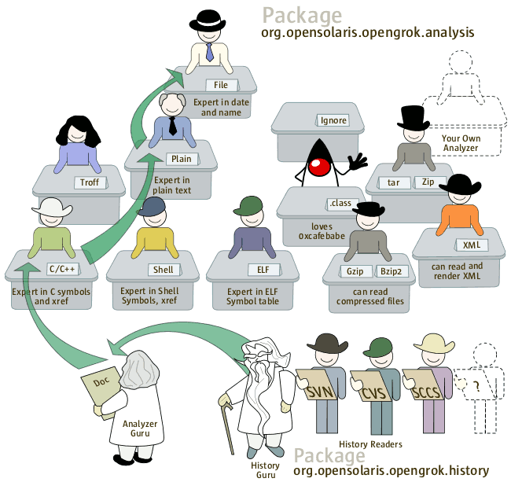

# Internals

By Chandan B.N, Feb 2006

OpenGrok contains these main packages:

- org.opengrok.analysis: Responsible for analyzing programs, source files, archives like ZIP, tar, documents like man pages, xml and html files, images etc.,
- org.opengrok.index: Builds or updates the Lucene index, recursively going down the directory tree.
- org.opengrok.search: Has utilities that provide interface for search results, matched context etc.
- org.opengrok.history: Abstraction for source code version control.
- org.opengrok.web: Utility routines used by the the web application.

While the source is the ultimate reference guide for how it works, here
is a brief illustration of certain mechanisms.

## Analysis

Think of the package as a separate department having engineers (called
Analyzers) who are subject matter experts in each type of program or
file type. CAnalyzer knows something about C programming language. The
ELF Analyzer knows how to read a ELF symbol and string table from an ELF
(executable) file.

Central to analysis, is the Analyzer Guru. He knows all the Analyzers by
name. Most analyzers sit in static offices. Hiring a new Analyzer for
each analysis work was a bit expensive.

When the indexer thinks he needs to analyze a file to be indexed, he calls Analyzer Guru. Analyzer Guru knows exactly who to send the file to. He creates a blank [Lucene Document](http://lucene.apache.org/java/docs/api/org/apache/lucene/document/Document.html) and a \[http://java.sun.com/j2se/1.5.0/docs/api/java/io/FileInputStream.html FileInputStream\] and gives it to the appropriate Analyzer. He knows the analyzers by name, because they would initially tell him the file extensions and magic numbers of file types they are experts in.

On getting a document, an Analyzer sends it to his boss (super) to get it filled with more Lucene fields. A boss sends it to his boss, and so on. Higher up the management chain, they do less (specialized) work. For example while CAnalyzer knows a great deal about C keywords and comments and knows how to generate hyper-text cross-reference a C file, his boss Plain Analyzer can only read plain text files. He has poor punctuation skills and ignores most of the punctuation marks that he thinks are unnecessary. He knows what websites and email addresses are, so when he is asked to cross reference a file, he just hyper-links the URLs he can recognize.

Plain Analyzer also does an important job. He out sources finding definitions in a program file to Exuberant Ctags. He sends out the file to exuberant ctags, which tells him exactly what symbols are considered definitions. Plain Analyzer adds that information to the Lucene Document.

His boss, File Analyzer is the boss of the department. Every one reports to him. All he does is to stamp the Lucene document with file date and name and sends it back.

This package quite modular. It can be extended to analyze any program type. To add an Analyzer for a new type of programming lang